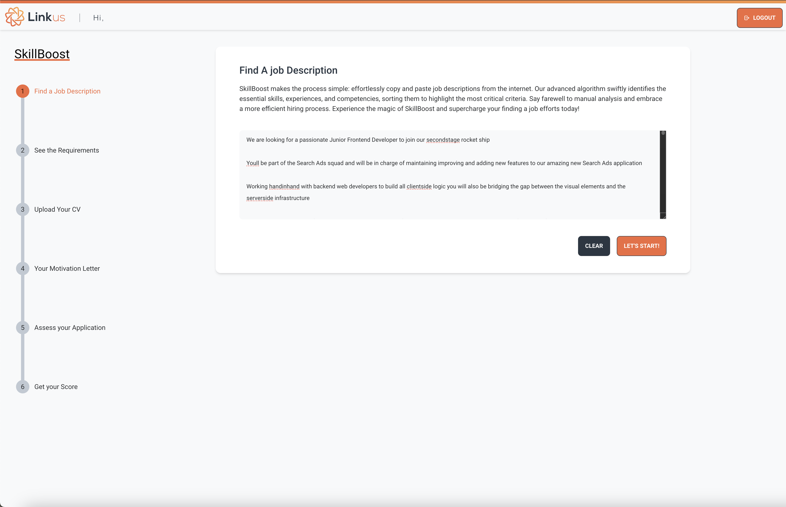
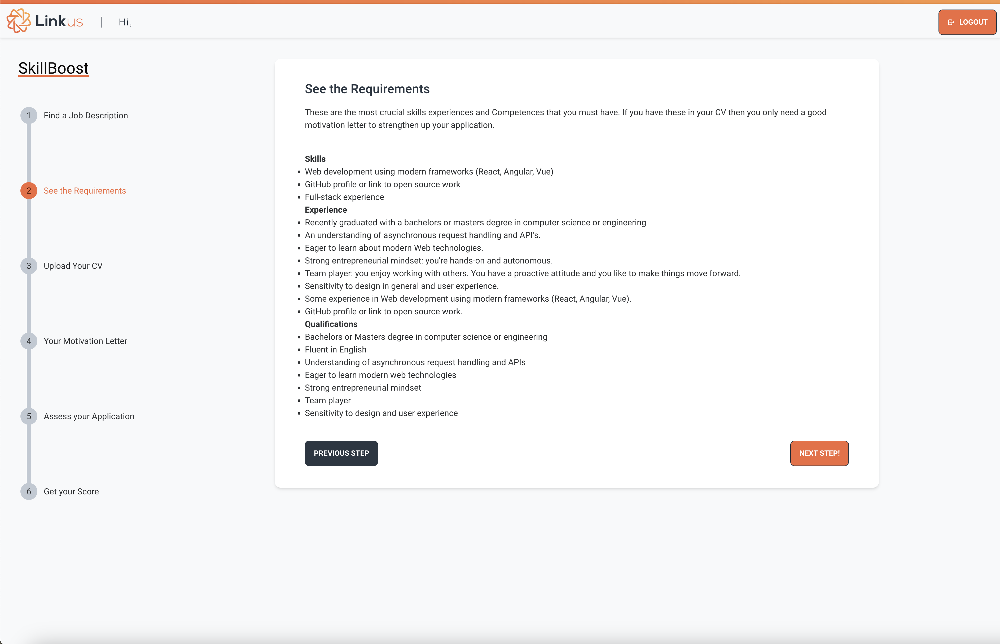
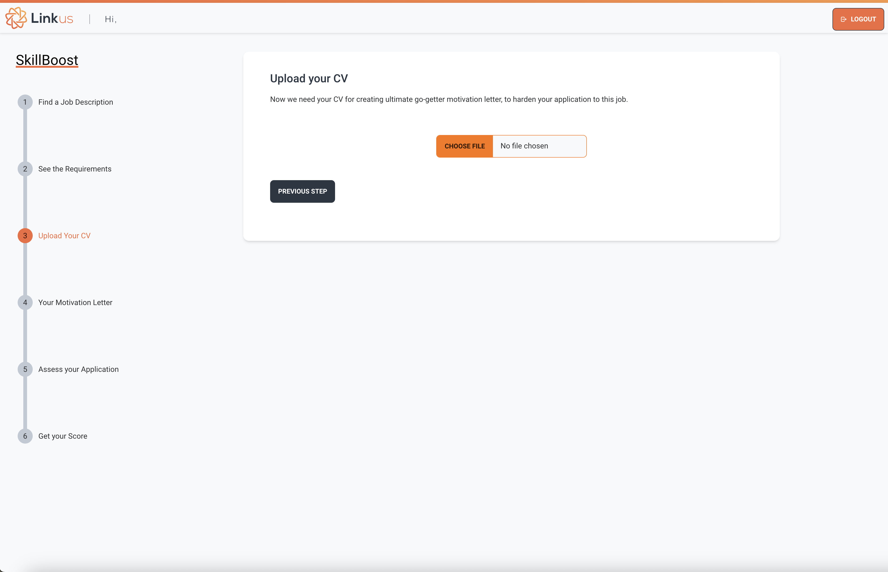
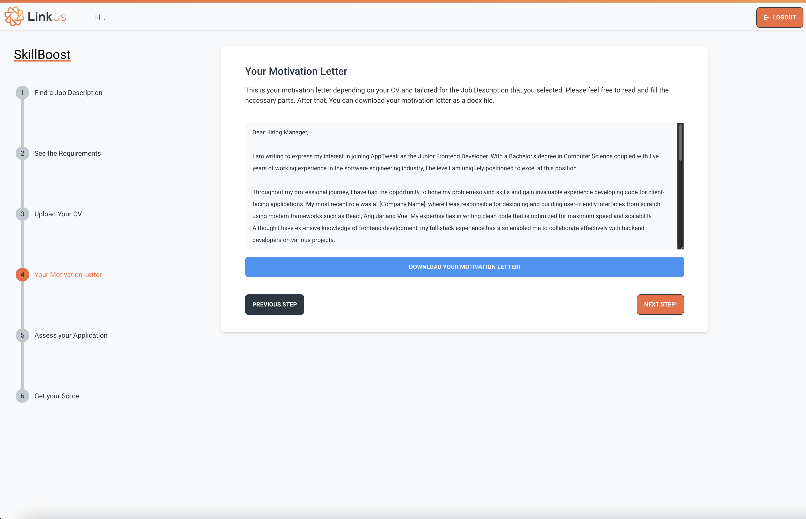
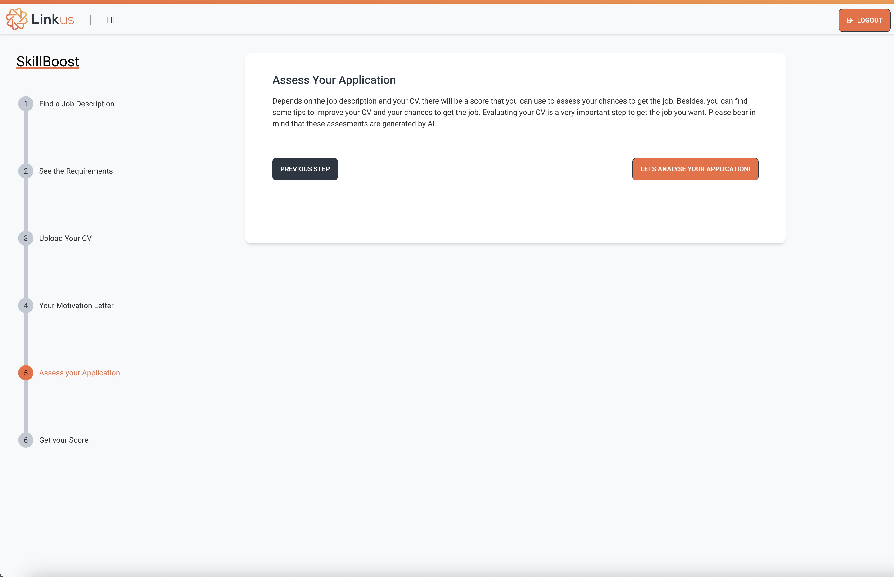
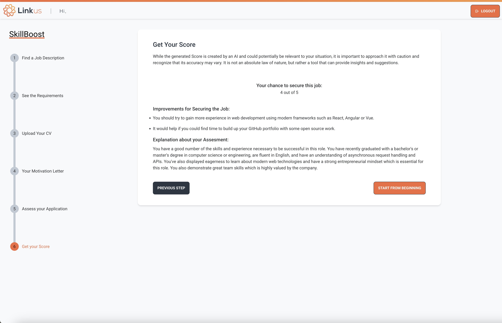

# Skillboost

A job application tool for specific job description.

1. Copy paste a job description.
2. Skillboost will summarize the requirements.
3. Upload your CV for parsing.
4. Skillboost will generate a motivation letter depending on your CV and job description.
5. Generate an assessment for your application and will show you some suggestions and score points.

### Technology

      

### Screenshots

---

---

--- 

---

---

---
